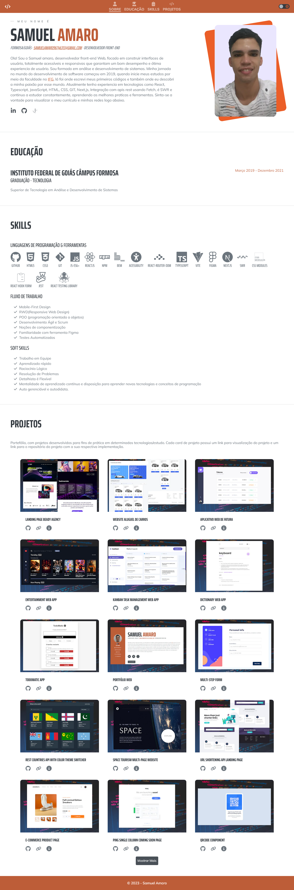

# Meu Portfólio

Portfólio/Currículo em formato web, para demostrar informações e experiências profissionais como desenvolvedor front-end.

## Visão Geral



### Links

 - [Reposítorio Projeto](https://github.com/Samuel-Amaro/meu-portfolio)
 - [Resultado Projeto](https://meu-portfolio-topaz-alpha.vercel.app/)

### Construído com

 - HTML5
 - CSS3(Flex-Box, Grid, Mobile-First workflow, Responsive Web Design, CSS Modules, Normalize, Bem Methodology)
 - Typescript
 - Web Acessibility(a11y)
 - React
 - NPM
 - Next.js App Router
 - Hook SWR
 - LocalStorage Web API

## Getting Started

First, run the development server:

```bash
npm run dev
# or
yarn dev
# or
pnpm dev
```